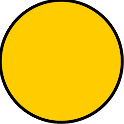

# nhl input file specification

This document describes the structure and practices for the scenario file for nhl. Besides technical requirements this specification also covers also some practices which ease the handling of the files while using yEd.

## ToDo

- [ ] Introduce `execute`
- [ ] XSD definitions
- [ ] Node output (types)
- [ ] Node execute (types)
- [ ] Error Handling

## File

nhl takes a GraphML file as an input. There are different editors which can create and modify such network files. The application yEd seems to be the most suiting application for this use case.


## Properties

In order to define the scenario functionality within a GraphML Network custom properties are used. This section contains all available properties. The structure of each XML property is defined by an XSD schema. nhl only accepts valid property values.

### Graph: Description 

**Type.** String.

**Required.** No.

**Usage.** Gives some information about the scenario defined by the graph.


### Graph: Author

**Type.** String.

**Required.** No.

**Usage.** Author(s) of the scenario.


### Graph: Version

**Type.** String.

**Required.** No.

**Usage.** Version number of the scenario.


### Graph: Languages

**Type.** XML (`languageDefinition`).

**Required.** Yes.

**Usage.** Defines the available languages in the scenario. Each node with a language specific functions (like audio) has to provide an implementation for all languages.

**Example** 

```xml
<language id="en" name="English" value="1"/>
<language id="de" name="German" value="2"/>
<language id="de_ch" name="Swiss-German" value="3"/>
```

**Attributes**

`id`. Unique identifier for a language. This is used to tie all other language specific elements to the given language. It's highly recommended to use the two char code of a given language (like »de«, »en«).

`name`. Human readable name of the language. Used for debugging purposes.

`value`. A numeric value between 0 and 9 which ties an language to a user input number in the language menu.


### Edge: Value

**Type.** Integer between 0 and 9.

**Required.** No.

**Usage.** Defines the target number for a menu.


### Node: Type

**Type.** String, see section »Node types« for more information on allowed values.

**Required.** Yes.

**Usage.** Defines the type of a node, see the »Node types» section for more information.


### Node: Variable

**Type.** String.

**Required.** No.

**Usage.** Exclusively used in the if node. Defines a variable name which value will read by the if node.


### Node: Output

**Type.** XML, allowed values depend on the given node type. See section »Node content« for more information. 

**Required.** Yes.

**Usage.** Defines the content/output of a node. See the section »Node content« for more information.


### Node: Execute

**Type.** XML, allowed values depend on the given node type. See section »Node execute« for more information. 

**Required.** Yes.

**Usage.** Defines the behavior for the node. All content of this property will be executed after the output of the content.


## Node type

Each node has a specific type which defines it's behavior.

### Start



Entry point of an scenario. If there is one than one starting point in a file the application will choose randomly one of the available start nodes. The `output` and `execute` properties are ignored for this kind of node.


### End


When a end node is reached the scenario playback terminates and has to be started again. The `output` and `execute` properties are ignored for this kind of node.


### Language


Executes/plays whatever defined by the `output` property of the node and then let's the user choose between the languages as defined in the `language` graph property. The language will then be used. The `execute` property will be ignored.


### Menu


Executes/plays whatever defined by the `output` property of the node and then lets the user input an value between 0 and 9. It then chooses the outgoing edge with the same `value` as given by the user. The `execute` property will be ignored.


### Execute


Executes/plays whatever defined by the `output` property, then executes the content of `execute` and finishes by following the edge to the next node. If multiple outgoing edges are present one will be chosen randomly.


### If


Reads the content of the given `variable` property and then takes the edge which value compares true with it.


## Node output

- tts
- audio


## Node execute

- rpc
- value
- value-set


## Error Handling

- `invalidUserInput`
- `valueNotDefined`
- `noUserInput`